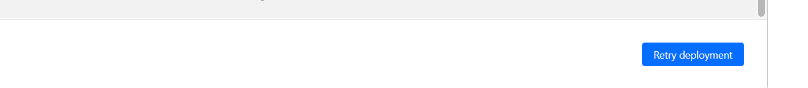

# ticketgoClone
 
# Mục Lục {#mục-lục .TOC-Heading .unnumbered}

[I. Hướng dẫn deploy [2](#hướng-dẫn-deploy)](#hướng-dẫn-deploy)

[1. Deploy Front-end trên CloudFlare
[2](#deploy-front-end-trên-cloudflare)](#deploy-front-end-trên-cloudflare)

[2. Deploy Back-end trên server Ubuntu
[7](#deploy-back-end-trên-server-ubuntu)](#deploy-back-end-trên-server-ubuntu)

[II. Hướng dẫn quản lý website
[10](#hướng-dẫn-quản-lý-website)](#hướng-dẫn-quản-lý-website)

[1. Tạo thông tin [10](#tạo-thông-tin)](#tạo-thông-tin)

[a) Đăng nhập vào tài khoản LarkSuite
[10](#đăng-nhập-vào-tài-khoản-larksuite)](#đăng-nhập-vào-tài-khoản-larksuite)

[b) Tạo sản phẩm trên Larksuite sau khi đăng nhập thành công
[11](#tạo-sản-phẩm-trên-larksuite-sau-khi-đăng-nhập-thành-công)](#tạo-sản-phẩm-trên-larksuite-sau-khi-đăng-nhập-thành-công)

[2. Quản lý đơn hàng [14](#quản-lý-đơn-hàng)](#quản-lý-đơn-hàng)

[III. Tổng kết [14](#tổng-kết)](#tổng-kết)

[1. Những thứ đã đạt được
[14](#những-thứ-đã-đạt-được)](#những-thứ-đã-đạt-được)

[a. Đối với Challenge [14](#đối-với-challenge)](#đối-với-challenge)

[b. Đối với cả kỳ thực tập
[15](#đối-với-cả-kỳ-thực-tập)](#đối-với-cả-kỳ-thực-tập)

[2. Những thứ chưa đạt được
[15](#những-thứ-chưa-đạt-được)](#những-thứ-chưa-đạt-được)

[a. Đối với Challenge [15](#đối-với-challenge-1)](#đối-với-challenge-1)

[b. Đối với cả kỳ thực tập
[15](#đối-với-cả-kỳ-thực-tập-1)](#đối-với-cả-kỳ-thực-tập-1)

# Hướng dẫn deploy

## Deploy Front-end trên CloudFlare

Để deploy phần front-end, chúng ta cần tạo tài khoản và đăng nhập vào
CloudFlare

Sau khi tạo tài khoản và đăng nhập thành công, ta tiến hành deploy qua
các bước sau:

Bước 1: Chọn mục Workers & Pages ở thanh menu bên trái giao diện:

{width="4.271127515310586in"
height="2.280673665791776in"}

Figure 1 Workers & pages

Bước 2: Chọn mục Overview và click Create application

{width="5.609589895013124in"
height="2.458990594925634in"}

Figure 2 Create application

Bước 3: Sau chọn Create application, giao diện sẽ chuyển sang như thế
này:

{width="5.629101049868766in"
height="2.7357677165354333in"}

Figure 3 Create application

Tiếp tục chọn tab Pages và chọn Connect to Git

{width="5.5797101924759405in"
height="2.2223458005249346in"}

Figure 4 Connect to Git

Bước 4: Chọn tài khoản liên kết Git mà bạn dùng để lưu trữ project, ở
đây tôi lưu trữ trên GitLab:

{width="4.1809295713035874in"
height="2.5460793963254593in"}

Figure 5 Choose project

Bước 5: Chọn project mình muốn deploy và click Begin setup, do tôi đã
deploy project TicketGoClone rồi nên tôi sẽ sử dụng JsSIPDemo để làm ví
dụ:

{width="5.860112642169729in"
height="2.993290682414698in"}

Figure 6 Save and Deploy

-   Project name: dùng để đặt tên cho project

-   Chọn branch muốn deploy ở mục Production branch

{width="6.5in"
height="4.4527777777777775in"}

Figure 7 Save and Deploy

-   Build command và Build output directory thì điền thông tin như trên

-   Click chọn Save and Deploy

Đây là giao diện build project

{width="5.350505249343832in"
height="2.641916010498688in"}

Figure 8 Build project

Nêu build thành công thì web sẽ báo build thành công và có thể truy cập
qua link đã cấp sẵn. Ví dụ: Jssipdemo

{width="3.972055993000875in"
height="0.6702832458442695in"}

Figure 9 Project name

Nếu không thành công, bạn làm theo thứ tự chọn Overview =\> chọn Project
cần deploy =\> chọn setting =\> chọn Builds & deployments

Ở mục Build system version: set tất cả tùy chọn ở mục đó sang version 1.

{width="6.5in"
height="2.6395833333333334in"}

Figure 10 Build system version

Cuối cùng ta trở lại mục Deployments của project và chọn phần view
details của phần deploy

{width="6.5in"
height="3.4881944444444444in"}

Figure 11 Retry deploy

Cuối cùng chọn retry deploy vầ đợi kết quả

{width="2.5748239282589678in"
height="0.8454636920384951in"}

Figure 12 Retry deploy

## Deploy Back-end trên server Ubuntu

**Từ xa đến máy chủ ubuntu bằng tài khoản được cung cấp**

-   ssh ubuntu@15.235.202.44

-   chmod 600 /mnt/c/newkey/privatekey

-   ssh -i /mnt/c/newkey/privatekey <ubuntu@15.235.202.44>

**Client**

-   ssh-keygen -t rsa -b 4096 -C \"gialap851@gmail.com\"

-   Enter without do anything

**Server ubuntu**

-   sudo adduser gadmin

-   sudo usermod -aG sudo gadmin

-   sudo -su gadmin

-   nano \~/.ssh/authorized_keys

-   mkdir \~/.ssh

-   chmod 700 \~/.ssh

-   nano \~/.ssh/authorized_keys

-   chmod 600 \~/.ssh/authorized_keys

-   logout

```{=html}
<!-- -->
```
-   bash: logout: not login shell: use \`exit\'

-   exit

**Kiểm tra kết nối với gadmin**

-   ssh -i /mnt/c/newkey/id_rsa gadmin@15.235.202.44 (Add new user at
    local if it is not work)

**(Cập nhật và thiết lập máy chủ)**

-   ls

-   sudo apt update

-   sudo apt install curl

-   curl -sL https://deb.nodesource.com/setup_lts.x \| sudo -E bash -

-   sudo apt install -y nodejs

**(Tạo dự án tại local )**

-   mkdir my-app

-   cd my-app

-   git clone https://github.com/gialap210502/ticketgoClone.git

-   sudo rm -r node_modules

-   Cd to project server and npm install

-   Cd out to server and sudo npm install -g pm2

-   Cd to server folder and run pm2 start index.js

-   pm2 save

-   pm2 startup

**Tạo host với subDomain và IP**

-   sudo nano /etc/hosts

-   \[sudo\] password for gadmin: 123

-   Tạo ip

Bước cuối cùng là cấu hình đăng ký SSL, mình đăng ký SSL qua các bước
được hướng dẫn qua
[Link](https://viblo.asia/p/cau-hinh-ssl-https-voi-nginx-va-lets-enscrypt-3P0lP86blox)\
\
và đây là kết quả sau khi đăng ký được SSL thành công:

{width="6.5in"
height="3.4854166666666666in"}

Figure 13 Đăng ký thành công SSL

Kết quả trang web đã deploy thành công cả front-end và back-end:\
{width="6.5in"
height="3.535416666666667in"}

Figure 14 Deploy web successful

# Hướng dẫn quản lý website

## Tạo thông tin

### Đăng nhập vào tài khoản LarkSuite

Đầu tiên bạn cần đăng nhập vào tài khoản lark mà bạn đã cấu hình cho
server, ở đây tôi sử dụng tài khoản Gialap

{width="4.233333333333333in"
height="4.466666666666667in"}

Figure 15 Đăng nhập vào Lark

Sau khi đăng nhập thành công, web sẽ chuyển sang giao diện Lark
Developer:\
{width="6.5in"
height="3.1333333333333333in"}

Figure 16 Giao diện Lark Developer của Larksuite

### Tạo sản phẩm trên Larksuite sau khi đăng nhập thành công

Sau khi đăng nhập thành công, bạn click chuột vào biểu tượng menu cạnh
avatar profile ở góc phải của giao diện Lark developer:

{width="1.1667683727034122in"
height="0.7667333770778653in"}

Figure 17 Menu

Tiếp tục chọn phần Docs:

{width="2.838672353455818in"
height="2.6707370953630796in"}

Figure 18 Chọn Docs

Tiếp tục chọn file đã lưu sản phẩm, ở đây tôi lưu sản phẩm ở file này:

{width="7.1242924321959755in"
height="0.49322069116360456in"}

Figure 19 File lưu sản phẩm

Sau khi chọn vào file trên, tab chứa thông tin file đó xuất hiện như thế
này:

{width="6.5in"
height="1.913888888888889in"}

Figure 20 File information

Ta chọn vào tab Product Iventory phía bên trái màn hình để tiến hành
quản lý sản phẩm:

{width="2.5835575240594926in"
height="2.5835575240594926in"}

Figure 21 Product Iventory

Tại đây, ta đã có thể thực hiện các thao tác quản lý các thông tin sản
phẩm:

{width="6.5in"
height="2.5597222222222222in"}

Figure 22 Product information management

Để thêm sản phẩm, ta click vào dấu cộng (+) phía dưới bảng :

{width="1.8710083114610674in"
height="1.127402668416448in"}

Figure 23 Click dấu cộng (+) để thêm sản phẩm

Để xóa, ta click chuột phải vào sản phẩm cần xóa và chọn xóa bản ghi:

{width="2.8008092738407697in"
height="3.091046587926509in"}

Figure 24 Xóa sản phẩm

Để sửa thông tin của sản phẩm, ta click đúp chuột vào ô cần sửa và tiến
hành sửa thông tin:

{width="3.2252799650043746in"
height="0.6250546806649169in"}

Figure 25 Sửa sản phẩm

## Quản lý đơn hàng

Để quản lý đơn hàng, ta cũng sẽ thực hiện các bước như tạo sản phẩm,
nhưng ta sẽ chọn tab "Operation \| Orders":

{width="2.4918821084864393in"
height="1.7084809711286089in"}

Figure 26 Orders

Ở đây, sẽ hiển thị tất cả thông tin mà khác hàng đã mua thành công, bao
gồm thông tin sản phẩm và thông tin người mua :

{width="6.5in"
height="2.1597222222222223in"}

Figure 27 Order informations

# Tổng kết

## Những thứ đã đạt được

### Đối với Challenge

Đối với challenge, em đã thành công đạt được những yêu cầu nhất định như
sau:

-   Clone a front store within a week for reusing httml/css then
    relayout into a theme by react.js. Require: Applying JAM
    architecture and cloudflare pages

-   Build an express.js server to handle:

```{=html}
<!-- -->
```
-   API to communicate between front store and larksuit api for
    > Product/Price/Customer/Sales management

-   API to communicate between front store, VNPT Pay/Pazapay and
    > larksuit api for Order/Payment Management

-   API to communicate between front store and bubble api for front
    > store layout management.

-   API to comunicate between larksuite api and 3rd vendor\'s
    > Inventory/Ship management (Example: Vinpear land\'s api)

### Đối với cả kỳ thực tập

Đối với cả kỳ thực tập, em đã thành công tìm hiểu được các công nghệ mới
như:

-   Sử dụng Puppeteer để làm Automation testing

-   Biết sử dụng công nghệ mới ( đối với em ) để phát triễn website:
    NodeJS, ReactJS, MongoDB, ExpressJS

-   Biết sử dụng api bên thứ 3 như Lark để sử dụng như một database

-   Biết cấu hình Ubuntu để deploy dự án và cách đăng ký SSL

-   Biết deploy qua CloudFlare

## Những thứ chưa đạt được

### Đối với Challenge

Em vẫn chưa hoàn thành task sau:

-   Use bubble to build portal (cms) to control multi front store
    layout, config and deploy new front store on Cloudflare pages

### Đối với cả kỳ thực tập

Do một số việc không mong muốn về task test performance nên em vẫn chưa
có thể áp dụng công nghệ đó vào bài tập cuối khóa
